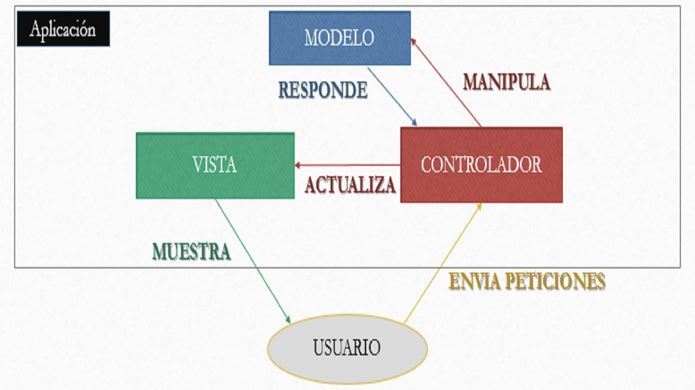

# Agenda

# Agenda

## Crud Agenda utilizando la arquitectura MVC

#### El patrón MVC  permite separar la aplicación en tres capas que aunque estén relacionadas Vista,  Controlador y el Modelo.

**Modelo:**  es la información la cual el usuario puede visualizar en pantalla.

**Vista: ** es la representación gráfica o pantalla que estas viendo en este momento, La vista requiere del Modelo para mostrar la información en la pantalla.

**Controlador:**  es el puente entre la vista y el modelo, ya que desde el controlador podemos hacer operaciones que cambien el modelo lo cual representa un cambio en los datos de la vista.

